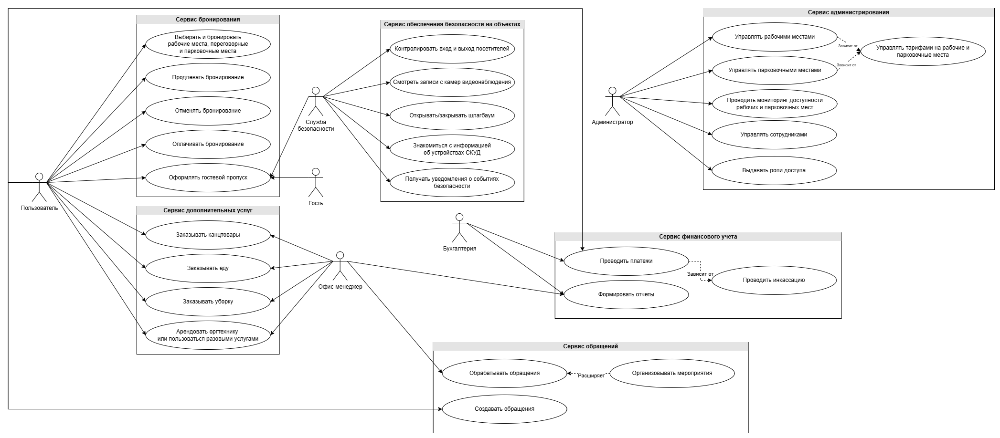
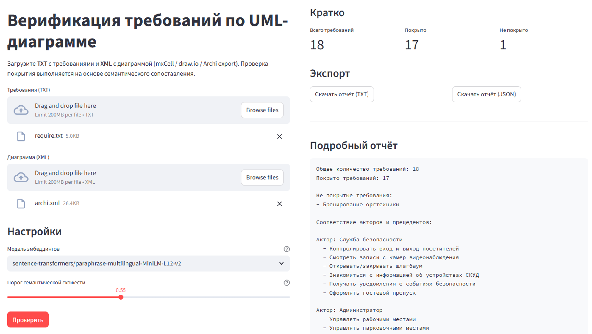

## Пример работы модуля

В репозитории приведён пример входных данных и результатов работы модуля
семантической верификации требований.

### Описание входных данных

Файл `require.txt` содержит перечень функциональных требований системы в текстовом виде.
Каждое требование задаётся отдельной строкой и начинается с символа `-`.

Пример:

    - Бронирование рабочих мест
    - Оформление гостевого пропуска
    - Заказ канцелярских принадлежностей

Файл `archi.xml` представляет собой экспорт UML-диаграммы прецедентов,
созданной в редакторе draw.io. Диаграмма включает акторов,
прецеденты и связи между ними.

### Результаты работы

В результате анализа формируется отчёт, включающий:
- общее количество требований;
- количество покрытых и непокрытых требований;
- перечень требований, не имеющих семантического соответствия в UML-модели;
- соответствие акторов и прецедентов;
- список прецедентов, не связанных ни с одним актором.

